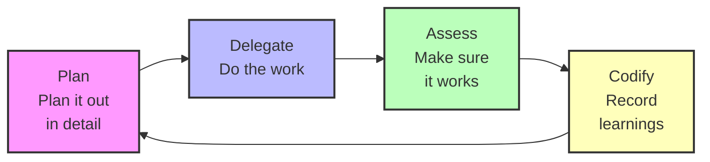

# TrayaHealth Claude Code Plugin Marketplace

The official Traya Health Claude Code plugin marketplace where engineers from Traya Health share their workflows. Features two production-ready plugins for web and mobile development with AI-powered tools that implement compounding engineering principles.

## Available Plugins

This marketplace provides two specialized plugins:

### 🌐 traya-compounding-engineering
**For React and Next.js web development**

AI-powered development tools that make each unit of engineering work easier than the last. Transform feature ideas into structured plans, execute them systematically, and ensure quality with multi-agent code reviews.

- **16 specialized agents** for development, security, performance, and architecture
- **6 commands** for planning, execution, review, and workflow automation
- **4 skills** for complete UI development, API integration, testing, and code review
- **5 bundled MCP servers** (Figma, Chrome DevTools, Context7, Serena, Postman)

**Best for:** Web applications, SPAs, server-side rendered apps, static sites

### 📱 traya-react-native
**For iOS and Android mobile development**

Comprehensive React Native development workflow with end-to-end support for building high-quality mobile apps. Automated testing on both iOS Simulator and Android devices ensures platform parity.

- **16 specialized agents** including platform-specific specialists for iOS and Android
- **6 commands** for mobile feature planning, execution, and review
- **4 workflow skills** with automatic iOS and Android testing integration
- **6 bundled MCP servers** (iOS Simulator, Mobile Device, Figma, Postman, Context7, Serena)

**Best for:** React Native mobile apps, cross-platform iOS/Android development

---

## Quick Start

### Standard Installation

**Step 1:** Add the marketplace to Claude:

```bash
/plugin marketplace add https://github.com/shivrajkumar/traya-plugin
```

**Step 2:** Install the plugin you need:

```bash
# For web development (React/Next.js)
/plugin install traya-compounding-engineering

# For mobile development (React Native)
/plugin install traya-react-native
```

### One-Command Installation
Use the [Claude Plugins CLI](https://claude-plugins.dev) to skip the marketplace setup:

```bash
# For web development
npx claude-plugins install @shivrajkumar/traya-plugin/traya-compounding-engineering

# For mobile development
npx claude-plugins install @shivrajkumar/traya-plugin/traya-react-native
```

This automatically adds the marketplace and installs the plugin in a single step.

---

# Web Development Plugin (traya-compounding-engineering)

A Claude Code plugin for React and Next.js development that makes each unit of engineering work easier than the last. Transform how you plan, build, and review code using AI-powered tools that systematically improve your development workflow.

## What Is Compounding Engineering?

**Each unit of engineering work should make subsequent units of work easier—not harder.**

Traditional development accumulates technical debt. Every feature adds complexity. Every change increases maintenance burden. The codebase becomes harder to work with over time.

Compounding engineering inverts this. Each feature you build:
- Documents patterns for the next feature
- Creates reusable components that accelerate future work
- Establishes conventions that reduce decision fatigue
- Codifies knowledge that compounds across the team

This plugin provides the tools to make compounding engineering practical. It transforms vague ideas into structured plans, executes those plans systematically, and ensures every change meets your quality bar before merging.



## How It Works

The plugin follows a three-step workflow that makes development compound:

### 1. Plan: Turn Ideas Into Structured Issues

Use `/traya-compounding-engineering:plan` to transform feature descriptions into comprehensive GitHub issues.

**What it does:**
- Researches your codebase to find similar patterns and conventions
- Analyzes framework documentation and best practices
- Creates detailed acceptance criteria and implementation plans
- Generates code examples that follow your existing patterns

**The result:** Issues that make implementation easier because they've already done the research and planning work.

### 2. Work: Execute Plans Systematically

Use `/traya-compounding-engineering:work` to execute work plans with isolated worktrees and systematic task tracking.

**What it does:**
- Creates isolated git worktrees for clean development
- Breaks down plans into trackable todos
- Executes tasks systematically with continuous validation
- Runs tests and quality checks after each change

**The result:** Features built correctly the first time, with full test coverage and no regressions.

### 3. Review: Ensure Quality Before Merging

Use `/traya-compounding-engineering:review` to perform exhaustive multi-agent code reviews.

**What it does:**
- Checks out your PR in an isolated worktree for deep analysis
- Runs 12+ specialized review agents in parallel
- Identifies security issues, performance problems, and architectural concerns
- Creates trackable todos for every finding

**The result:** Code that meets your quality bar and documents learnings for future work.

## Practical Examples

### Example: Plan a New Feature

```bash
# Create a detailed GitHub issue from a feature description
claude /traya-compounding-engineering:plan "Add interactive product gallery with filters, search, and image carousel"
```

The command will:
1. Research how your codebase handles filtering and search
2. Find similar UI patterns in your repository
3. Check framework documentation for React/Next.js best practices
4. Generate a complete issue with acceptance criteria, component structure, and code examples

You can choose detail levels:
- **Minimal:** Quick issues for simple features
- **More:** Standard issues with technical considerations
- **A lot:** Comprehensive issues for major features

### Example: Execute a Work Plan

```bash
# Execute a plan document systematically
claude /traya-compounding-engineering:work path/to/plan.md
```

The command will:
1. Create a feature branch and isolated worktree
2. Analyze the plan and create a comprehensive todo list
3. Execute each task systematically
4. Run tests after every change
5. Create a pull request when complete

### Example: Review a Pull Request

```bash
# Review the latest PR
claude /traya-compounding-engineering:review

# Review a specific PR
claude /traya-compounding-engineering:review 123

# Review from a GitHub URL
claude /traya-compounding-engineering:review https://github.com/user/repo/pull/123
```

The command will:
1. Check out the PR in an isolated worktree
2. Run specialized review agents in parallel:
   - TypeScript reviewer for code quality and type safety
   - Security sentinel for vulnerability scanning
   - Performance oracle for optimization opportunities
   - Architecture strategist for design review
   - Pattern recognition specialist for code patterns
3. Present findings one by one for triage
4. Create todos for approved findings

## All Commands

The plugin includes six commands for different stages of development:

### `/traya-compounding-engineering:plan [feature description]`
Creates detailed GitHub issues from feature descriptions. Includes research, acceptance criteria, and implementation guidance.

### `/traya-compounding-engineering:work [plan file]`
Executes work plans systematically with worktrees, todos, and continuous validation.

### `/traya-compounding-engineering:review [PR number or URL]`
Performs exhaustive multi-agent code reviews with security, performance, and architecture analysis.

### `/traya-compounding-engineering:triage`
Presents findings one by one for review and converts approved items into trackable todos.

### `/traya-compounding-engineering:resolve_todo_parallel`
Resolves multiple todos in parallel with systematic execution and quality checks.

### `/traya-compounding-engineering:generate_command`
Generates new Claude Code commands from descriptions.

## All Agents

The plugin includes 16 specialized agents that provide expertise in different areas:

### Development & Implementation
- **frontend-developer:** React/Next.js implementation with TypeScript and Tailwind CSS
- **ui-ux-designer:** Design-to-code implementation, accessibility, and responsive design
- **test-automator:** Test automation with Jest, Vitest, Playwright, and Chrome DevTools

### Code Review Specialists
- **typescript-reviewer:** TypeScript code review with type safety and best practices
- **code-simplicity-reviewer:** Identifies opportunities to simplify complex code

### Quality Guardians
- **security-sentinel:** Comprehensive security audits and vulnerability detection
- **performance-oracle:** Performance analysis and optimization recommendations

### Architecture & Patterns
- **architecture-strategist:** System design review and architectural guidance
- **pattern-recognition-specialist:** Identifies patterns and suggests improvements

### Research & Analysis
- **repo-research-analyst:** Analyzes repository patterns and conventions
- **best-practices-researcher:** Researches best practices for technologies
- **framework-docs-researcher:** Fetches relevant framework documentation
- **git-history-analyzer:** Analyzes git history for context and patterns

### Workflow & Communication
- **traya-style-editor:** Edits content to match TrayaHealth's style guide
- **feedback-codifier:** Converts feedback into actionable improvements
- **pr-comment-resolver:** Systematically resolves PR review comments

## Why This Makes Development Compound

Traditional development tools help you work faster. Compounding engineering tools make future work easier.

**Every `/traya-compounding-engineering:plan` you create:**
- Documents patterns that inform the next plan
- Establishes conventions that reduce planning time
- Builds institutional knowledge

**Every `/traya-compounding-engineering:work` execution:**
- Creates reusable components
- Refines your testing approach
- Improves your development process

**Every `/traya-compounding-engineering:review` you run:**
- Catches issues earlier
- Documents learnings for the team
- Raises the quality bar systematically

Over time, you're not just building features—you're building a development system that gets better with each use.

## Philosophy in Practice

The plugin embodies these compounding engineering principles:

**Prefer duplication over complexity:** Simple, clear code that's easy to understand beats complex abstractions. The shivraj-rails-reviewer enforces this strictly.

**Document as you go:** Every command generates documentation—issues, todos, review findings—that makes future work easier.

**Quality compounds:** High-quality code is easier to modify. The multi-agent review system ensures every change meets your quality bar.

**Systematic beats heroic:** Consistent processes beat individual heroics. The `/traya-compounding-engineering:work` command executes plans systematically, with continuous validation.

**Knowledge should be codified:** Learnings should be captured and reused. The research agents analyze your codebase to apply your own patterns back to you.

## Bundled MCP Servers

The Traya plugin includes 5 bundled MCP servers that automatically start when the plugin is enabled:

### 1. **Figma MCP Server**
Extract designs, design tokens, and generate code from Figma designs.
- **Bundled**: Connects to Figma Desktop App at `http://127.0.0.1:3845/mcp`
- **Requires**: [Figma Desktop App](https://www.figma.com/downloads/) with MCP server enabled in Preferences
- **Capabilities**: Get code, variable definitions, code connect map, images, create design system rules

### 2. **Chrome DevTools MCP Server**
Browser automation, visual testing, console debugging, and performance analysis.
- **Bundled**: Automatically available via `npx @executeautomation/chrome-devtools-mcp`
- **Capabilities**: Screenshot capture, page navigation, console logs, network monitoring, performance metrics, accessibility audits, Lighthouse reports

### 2. **Context7 MCP Server**
Access latest library documentation and best practices.
- **Bundled**: Automatically available via `npx @upstash/context7-mcp`
- **Capabilities**: Search documentation, get latest patterns, library examples, framework guides

### 3. **Serena MCP Server**
Semantic code analysis and symbol-level operations for efficient codebase understanding.
- **Bundled**: Automatically available via `uvx` from `git+https://github.com/oraios/serena`
- **Capabilities**: Semantic search, symbol analysis, code context, component discovery
- **Note**: Requires initial project indexing: `uvx --from git+https://github.com/oraios/serena serena project index`

### 4. **Postman MCP Server**
API design, testing, and validation.
- **Bundled**: Automatically available via `npx @postman/mcp-server`
- **Capabilities**: Create collections, test endpoints, run collections, validate schemas, performance testing

**Integration**: These MCP servers are configured in `.mcp.json` and start automatically when you enable the Traya plugin. No manual installation required - they integrate seamlessly with Claude's existing tools.

## All Skills

The plugin includes 4 specialized skills for complete workflows. **These skills are automatically invoked by `/traya:work` based on task detection** - you don't need to call them manually.

### UI Development & Testing
- **ui-developer:** Complete Figma-to-Next.js workflow with iterative design-matching and visual validation
- **ui-tester:** Comprehensive UI testing and debugging with Chrome DevTools integration
- **code-reviewer:** Dual-layer code review (task completion + technical quality) with production approval

### API Integration
- **api-integrator:** Complete API integration workflow from testing to production with Postman MCP validation, Chrome DevTools monitoring, and security audit

**How Skills Work**: When you run `/traya-compounding-engineering:work`, the command analyzes your plan and automatically invokes the appropriate skills. For UI tasks, it runs ui-developer → api-integrator (if needed) → ui-tester → code-reviewer. For API tasks, it runs api-integrator → ui-tester → code-reviewer. All skills leverage bundled MCP servers (Figma, Postman, Chrome DevTools, Context7, Serena) for comprehensive, production-ready results.

## Getting Started

1. Install the plugin using one of the methods above
2. The bundled MCP servers will start automatically (no setup needed!)
3. (Optional) For Serena: Run `uvx --from git+https://github.com/oraios/serena serena project index` to index your project
4. Run `/traya-compounding-engineering:plan` on your next feature idea to create a detailed implementation plan
5. Run `/traya-compounding-engineering:work` to execute the plan
   - **Skills automatically invoked**: `/traya-compounding-engineering:work` detects task types and automatically invokes appropriate skills (ui-developer, api-integrator, ui-tester, code-reviewer) with comprehensive MCP-powered workflows
6. Run `/traya-compounding-engineering:review` before merging for multi-agent code review
7. Repeat, and watch your development process compound

Each cycle makes the next cycle easier. That's compounding engineering.

---

# Mobile Development Plugin (traya-react-native)

A specialized Claude Code plugin for React Native development that brings compounding engineering principles to iOS and Android app development. Build high-quality mobile applications with automated cross-platform testing, design-to-code workflows, and comprehensive quality assurance.

## Why React Native Needs Specialized Tools

Mobile development introduces unique challenges:
- **Platform parity:** Components must work identically on iOS and Android
- **Native integration:** Bridging between JavaScript and native modules requires expertise
- **Performance constraints:** Mobile devices have limited resources compared to web
- **Device testing:** Manual testing on physical devices and simulators is time-consuming
- **Platform-specific APIs:** iOS and Android have different patterns and requirements

The traya-react-native plugin addresses these challenges with specialized agents and automated workflows.

## Key Features

### 🎨 Figma to React Native
Extract designs from Figma and generate React Native components that render identically on both platforms. The plugin automatically:
- Extracts design specifications and assets
- Generates StyleSheet-based styling
- Implements responsive layouts
- Verifies visual parity on iOS Simulator and Android devices

### 📱 Automated Cross-Platform Testing
Every component is automatically tested on both platforms:
- **iOS Simulator MCP:** Automated UI testing, screenshot capture, interaction simulation
- **Mobile Device MCP:** Android device/emulator testing with ADB integration
- **Visual verification:** Screenshot comparison between platforms
- **Performance profiling:** FPS monitoring, memory usage, startup time analysis

### 🔧 Platform-Specific Expertise
Specialized agents for React Native development:
- **rn-navigation-specialist:** React Navigation implementation and deep linking
- **rn-state-management-expert:** Redux, Zustand, Context API patterns
- **rn-native-module-specialist:** iOS/Android native module integration
- **rn-animation-specialist:** Reanimated and Animated API implementation
- **ios-simulator-specialist:** iOS-specific testing and automation
- **android-device-specialist:** Android-specific testing and automation

### 🚀 Complete Workflow Automation
The `/work` command automatically invokes skills based on task type:
- **UI tasks:** `rn-ui-developer` → `rn-api-integrator` → `rn-app-tester` → `rn-code-reviewer`
- **API tasks:** `rn-api-integrator` → `rn-app-tester` → `rn-code-reviewer`

Each skill ensures quality at every step with platform-specific validation.

## Practical Example: Building a Profile Screen

```bash
# 1. Plan the feature
/plan "Create user profile screen with avatar upload, editable fields, and settings"

# 2. Execute the plan (automatic workflow)
/work plan-profile-screen.md

# Behind the scenes, the plugin:
# ✓ Extracts design from Figma
# ✓ Generates React Native components with StyleSheet
# ✓ Implements avatar upload with react-native-image-picker
# ✓ Creates form validation
# ✓ Connects to user profile API
# ✓ Tests on iOS Simulator
# ✓ Tests on Android device
# ✓ Profiles performance (ensures 60 FPS)
# ✓ Audits accessibility (VoiceOver/TalkBack)
# ✓ Reviews code quality and security
# ✓ Creates comprehensive test coverage

# 3. Review before merging
/review
```

**Result:** Production-ready profile screen with:
- ✅ Pixel-perfect UI matching Figma on both platforms
- ✅ Camera integration tested on iOS and Android
- ✅ Type-safe API integration
- ✅ 60 FPS performance
- ✅ Full accessibility compliance
- ✅ Comprehensive test coverage

## Available Commands

All commands from the web plugin, optimized for React Native:

- `/plan [feature]` - Create detailed mobile feature plans
- `/work [plan]` - Execute with automatic iOS/Android testing
- `/review [PR]` - React Native-specific code review
- `/triage` - Issue triage with mobile considerations
- `/resolve_todo_parallel` - Parallel todo resolution
- `/generate_command` - Create custom mobile commands

## Specialized Agents (16 Total)

**Core Development:**
- rn-developer, rn-typescript-reviewer, rn-architecture-strategist, rn-best-practices-researcher

**Specialized Development:**
- rn-navigation-specialist, rn-state-management-expert, rn-native-module-specialist, rn-styling-expert, rn-animation-specialist

**Quality & Testing:**
- rn-performance-analyzer, rn-testing-specialist, rn-accessibility-auditor, rn-security-auditor

**Platform Operations:**
- ios-simulator-specialist, android-device-specialist, rn-pattern-recognition

## Bundled MCP Servers (6 Total)

1. **iOS Simulator MCP** - Automated iOS app testing
2. **Mobile Device MCP** - Android device/emulator automation
3. **Figma MCP** - Design extraction
4. **Postman MCP** - API testing
5. **Context7 MCP** - React Native library docs
6. **Serena MCP** - Codebase pattern analysis

All servers start automatically when the plugin is enabled.

## Getting Started with React Native

1. **Install the plugin:**
   ```bash
   /plugin install traya-react-native
   ```

2. **Setup requirements:**
   - **iOS:** macOS with Xcode and iOS Simulator
   - **Android:** Android Studio with device/emulator configured
   - **Figma:** Desktop app installed (for design extraction)

3. **Index your project (optional):**
   ```bash
   uvx --from git+https://github.com/oraios/serena serena project index
   ```

4. **Start building:**
   ```bash
   /plan "Your React Native feature"
   /work plan-file.md
   /review
   ```

## Learn More

- **Full documentation:** See [plugins/traya-react-native/README.md](./plugins/traya-react-native/README.md)
- **Compounding engineering philosophy:** [Read Full Story](https://every.to/source-code/my-ai-had-already-fixed-the-code-before-i-saw-it)