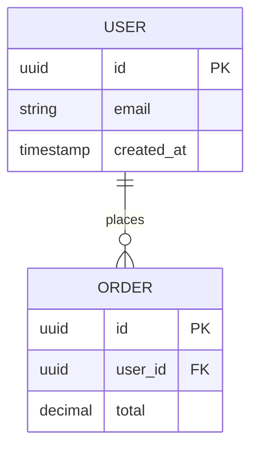

# Create GitHub Issue for Backend Development

## Model Recommendation

**⚠️ MODEL SWITCH RECOMMENDED**: Switch to **Claude Sonnet** for this planning phase.

For optimal results with this command:
1. Switch to Sonnet model for high-quality analysis and planning
2. After planning complete, switch to Haiku for implementation phases
3. Use Sonnet again for review phases

This leverages our multi-model workflow: Sonnet for strategic thinking (70% quality, 30% cost), Haiku for execution (70% cost, 30% quality).

## Introduction

Transform backend feature descriptions, bug reports, API design ideas, or infrastructure improvements into well-structured markdown files that follow project conventions and best practices. This command provides flexible detail levels to match your backend development needs.

## Feature Description

<feature_description> #$ARGUMENTS </feature_description>

## Main Tasks

### 1. Repository Research & Context Gathering

<thinking>
First, I need to understand the project's conventions and existing patterns, leveraging all available resources and use parallel subagents to do this.
</thinking>

Run these three agents in parallel at the same time:

- Task api-designer(feature_description)
- Task database-modeler(feature_description)
- Task architecture-strategist(feature_description)

**Reference Collection:**

- [ ] Document all research findings with specific file paths (e.g., `src/api/controllers/user.controller.ts:42`)
- [ ] Include URLs to external documentation and best practices guides
- [ ] Create a reference list of similar issues or PRs (e.g., `#123`, `#456`)
- [ ] Note any team conventions discovered in `CLAUDE.md` or team documentation
- [ ] Review OpenAPI/Swagger specifications if available
- [ ] Check database schema and migration patterns

### 2. Issue Planning & Structure

<thinking>
Think like a backend architect - what would make this issue clear and actionable? Consider API design, database impacts, security, performance, and scalability perspectives.
</thinking>

**Title & Categorization:**

- [ ] Draft clear, searchable issue title using conventional format (e.g., `feat:`, `fix:`, `perf:`, `security:`, `db:`)
- [ ] Identify appropriate labels from repository's label set (`gh label list`)
- [ ] Determine issue type: api-enhancement, bug, database-migration, performance, security

**Stakeholder Analysis:**

- [ ] Identify who will be affected by this issue (API consumers, frontend developers, operations, DBAs)
- [ ] Consider implementation complexity and required expertise (Node.js, NestJS, TypeORM, PostgreSQL, Redis)

**Content Planning:**

- [ ] Choose appropriate detail level based on issue complexity and audience
- [ ] List all necessary sections for the chosen template
- [ ] Gather supporting materials (API logs, database queries, performance metrics, security audit results)
- [ ] Prepare code examples, API endpoint specifications, or database schema diagrams if applicable
- [ ] Include OpenAPI/Swagger spec snippets if relevant

### 3. Choose Implementation Detail Level

Select how comprehensive you want the issue to be:

#### 📄 MINIMAL (Quick Issue)

**Best for:** Simple bug fixes, minor API improvements, small database changes

**Includes:**

- Problem statement or feature description
- Basic acceptance criteria
- Essential context only

**Structure:**

````markdown
[Brief problem/feature description]

## Acceptance Criteria

- [ ] API endpoint returns correct status codes
- [ ] Database changes include migration
- [ ] OpenAPI spec updated

## Context

[Any critical information about API, database, or integration]

## MVP

### src/api/controllers/user.controller.ts

```typescript
@Controller('users')
export class UserController {
  @Get(':id')
  async findOne(@Param('id') id: string): Promise<UserDto> {
    return this.userService.findOne(id);
  }
}
```

## References

- Related issue: #[issue_number]
- API documentation: [relevant_docs_url]
- Database schema: [schema_reference]
````

#### 📋 MORE (Standard Issue)

**Best for:** Most API features, database integrations, performance improvements, security enhancements

**Includes everything from MINIMAL plus:**

- Detailed background and motivation
- API design considerations
- Database schema impacts
- Security and performance implications
- Success metrics
- Dependencies and risks
- Basic implementation suggestions

**Structure:**

```markdown
## Overview

[Comprehensive description of the API feature, database change, or system improvement]

## Problem Statement / Motivation

[Why this matters for the backend system, API consumers, or infrastructure]

## Proposed Solution

[High-level approach including API design, database changes, and integration points]

## Technical Considerations

### API Design
- Endpoint structure and naming
- Request/response schema validation
- Authentication and authorization

### Database Impact
- Schema changes and migrations
- Index optimization
- Query performance

### Security Considerations
- Input validation and sanitization
- Authentication/authorization requirements
- Rate limiting and abuse prevention

### Performance Implications
- Caching strategy (Redis)
- Query optimization
- Response time targets

## Acceptance Criteria

- [ ] API endpoints implement OpenAPI 3.0 spec
- [ ] TypeORM migrations include rollback
- [ ] Unit tests cover service layer (>80% coverage)
- [ ] Integration tests validate API contracts
- [ ] Postman collection updated
- [ ] Error handling follows RFC 7807 (Problem Details)

## Success Metrics

[How we measure success - API response times, error rates, throughput]

## Dependencies & Risks

### Dependencies
- External API integrations
- Database schema changes
- Redis cache configuration

### Risks
- Breaking changes for API consumers
- Migration complexity
- Performance degradation

## References & Research

- Similar API implementations: [file_path:line_number]
- NestJS best practices: [documentation_url]
- TypeORM patterns: [file_path:line_number]
- Related PRs: #[pr_number]
```

#### 📚 A LOT (Comprehensive Issue)

**Best for:** Major API versions, architectural changes, complex microservice integrations, database refactoring

**Includes everything from MORE plus:**

- Detailed implementation plan with phases
- Alternative approaches considered (REST vs GraphQL, SQL vs NoSQL)
- Extensive API specifications with examples
- Database schema diagrams (ERD)
- Resource requirements and timeline
- Future considerations and extensibility
- Risk mitigation strategies
- Documentation requirements

**Structure:**

```markdown
## Overview

[Executive summary of backend system change]

## Problem Statement

[Detailed problem analysis with metrics, logs, and current system limitations]

## Proposed Solution

[Comprehensive solution design including API architecture, database design, and integration strategy]

## Technical Approach

### API Architecture

**Endpoint Design:**
- REST resource modeling
- GraphQL schema design (if applicable)
- Versioning strategy (URI vs header)

**Request/Response Format:**
```json
{
  "data": {...},
  "meta": {...},
  "links": {...}
}
```

### Database Design

**Entity Relationship Diagram:**


**Migration Strategy:**
- Zero-downtime deployment approach
- Data migration scripts
- Rollback procedures

### Implementation Phases

#### Phase 1: Foundation (Week 1)

- Database schema design
- TypeORM entity definitions
- Core service layer implementation
- Success criteria: Entities created, migrations tested
- Estimated effort: 3-5 days

#### Phase 2: API Development (Week 2)

- Controller implementation
- DTO validation with class-validator
- OpenAPI specification
- Success criteria: API endpoints functional
- Estimated effort: 5-7 days

#### Phase 3: Testing & Documentation (Week 3)

- Unit and integration tests
- Postman collection creation
- API documentation generation
- Performance testing and optimization
- Success criteria: >80% coverage, all tests green
- Estimated effort: 3-4 days

## Alternative Approaches Considered

### Option 1: GraphQL instead of REST
**Pros:** Flexible querying, single endpoint, strong typing
**Cons:** Complexity, caching challenges, learning curve
**Decision:** Rejected - team expertise in REST, simpler deployment

### Option 2: MongoDB instead of PostgreSQL
**Pros:** Schema flexibility, horizontal scaling
**Cons:** No ACID guarantees, complex transactions
**Decision:** Rejected - require relational integrity

## Acceptance Criteria

### Functional Requirements

- [ ] All API endpoints implement OpenAPI 3.0 specification
- [ ] Request validation using class-validator DTOs
- [ ] Response serialization using class-transformer
- [ ] Pagination, filtering, sorting on collection endpoints
- [ ] JWT authentication with refresh tokens
- [ ] Role-based authorization using guards

### Non-Functional Requirements

- [ ] API response time <200ms (p95)
- [ ] Database queries optimized with proper indexes
- [ ] Redis caching for frequently accessed data
- [ ] Rate limiting: 100 req/min per user
- [ ] OpenAPI documentation auto-generated
- [ ] OWASP Top 10 security compliance

### Quality Gates

- [ ] Test coverage >80% (Jest + Supertest)
- [ ] All TypeScript strict mode checks pass
- [ ] ESLint with no warnings
- [ ] Postman collection with all endpoints
- [ ] API documentation published
- [ ] Code review approved by 2+ developers

## Success Metrics

### Performance Metrics
- API response time: <200ms (p95), <500ms (p99)
- Database query time: <50ms average
- Cache hit rate: >80%
- Throughput: 1000 req/sec

### Quality Metrics
- Error rate: <0.1%
- Test coverage: >80%
- API uptime: 99.9%

## Dependencies & Prerequisites

### Infrastructure
- PostgreSQL 14+ with extensions (uuid-ossp, pgcrypto)
- Redis 6+ for caching and sessions
- Node.js 18+ LTS

### External Services
- Authentication service (if external)
- Third-party API integrations
- Message queue (if applicable)

### Team Dependencies
- Database schema review with DBA
- Security review for sensitive endpoints
- Frontend team coordination for API contracts

## Risk Analysis & Mitigation

### Risk 1: Database Migration Failure
**Probability:** Medium
**Impact:** High
**Mitigation:**
- Test migrations on staging environment
- Implement rollback scripts
- Use transactional migrations
- Schedule during low-traffic window

### Risk 2: Breaking API Changes
**Probability:** Low
**Impact:** High
**Mitigation:**
- API versioning strategy
- Deprecation warnings
- Backward compatibility period
- Consumer notification plan

### Risk 3: Performance Degradation
**Probability:** Medium
**Impact:** Medium
**Mitigation:**
- Load testing before deployment
- Database query optimization
- Implement Redis caching
- Monitoring and alerting

## Resource Requirements

### Development Team
- 1 Backend Engineer (primary)
- 1 Backend Engineer (reviewer)
- 1 DBA (schema review)
- 1 DevOps (deployment)

### Timeline
- Design & Planning: 2 days
- Implementation: 2-3 weeks
- Testing: 3-4 days
- Documentation: 2 days
- Total: 3-4 weeks

### Infrastructure
- Staging environment for testing
- Database migrations testing environment
- Load testing infrastructure

## Future Considerations

### Extensibility
- GraphQL support for advanced queries
- Websocket support for real-time updates
- Microservice decomposition strategy
- Event-driven architecture migration

### Scalability
- Horizontal scaling with load balancer
- Database read replicas
- Caching layer expansion
- CDN for static API responses

## Documentation Plan

### API Documentation
- [ ] OpenAPI 3.0 specification
- [ ] Postman collection with examples
- [ ] API changelog for versioning
- [ ] Authentication guide

### Developer Documentation
- [ ] Database schema documentation
- [ ] Service architecture diagram
- [ ] Deployment runbook
- [ ] Troubleshooting guide

### User Documentation
- [ ] API integration guide
- [ ] Code examples (TypeScript, JavaScript)
- [ ] Error code reference
- [ ] Rate limiting documentation

## References & Research

### Internal References

- Architecture decisions: [file_path:line_number]
- Similar API implementations: [src/api/controllers/example.controller.ts:42]
- Database patterns: [src/database/entities/user.entity.ts:15]
- Configuration: [src/config/database.config.ts:10]

### External References

- NestJS documentation: https://docs.nestjs.com
- TypeORM best practices: https://typeorm.io
- OpenAPI specification: https://swagger.io/specification/
- RFC 7807 Problem Details: https://tools.ietf.org/html/rfc7807
- OWASP API Security: https://owasp.org/www-project-api-security/

### Related Work

- Previous API PRs: #[pr_numbers]
- Related database issues: #[issue_numbers]
- Architecture decision records: [links]
```

### 4. Issue Creation & Formatting

<thinking>
Apply backend best practices for clarity and actionability, making the issue easy to scan and understand by both backend developers and API consumers
</thinking>

**Content Formatting:**

- [ ] Use clear, descriptive headings with proper hierarchy (##, ###)
- [ ] Include API examples in triple backticks with TypeScript syntax highlighting
- [ ] Add database diagrams using Mermaid (ERD, sequence diagrams)
- [ ] Include OpenAPI/Swagger spec snippets for API endpoints
- [ ] Use task lists (- [ ]) for trackable items that can be checked off
- [ ] Add collapsible sections for lengthy logs or API payloads using `<details>` tags
- [ ] Apply appropriate emoji for visual scanning (🐛 bug, ✨ feature, 🔒 security, ⚡ performance, 🗄️ database)

**Cross-Referencing:**

- [ ] Link to related issues/PRs using #number format
- [ ] Reference specific commits with SHA hashes when relevant
- [ ] Link to code using GitHub's permalink feature (press 'y' for permanent link)
- [ ] Mention relevant team members with @username if needed
- [ ] Add links to external API documentation, RFC specs, framework docs

**Code & Examples:**

```markdown
# Good example with syntax highlighting and line references

\`\`\`typescript
// src/api/controllers/user.controller.ts:42
@Post()
@UseGuards(JwtAuthGuard)
async create(@Body() createUserDto: CreateUserDto): Promise<UserDto> {
  return this.userService.create(createUserDto);
}
\`\`\`

# Database schema with Mermaid ERD
\`\`\`mermaid
erDiagram
    USER ||--o{ ORDER : places
    USER {
        uuid id PK
        string email
    }
\`\`\`

# Collapsible error logs
<details>
<summary>Full API error response</summary>

\`\`\`json
{
  "statusCode": 500,
  "message": "Internal server error",
  "error": "Error details here..."
}
\`\`\`
</details>
```

**Backend-Specific Considerations:**

- [ ] Include database migration scripts if schema changes
- [ ] Reference OpenAPI/Swagger specifications
- [ ] Note API versioning implications
- [ ] Document authentication/authorization requirements
- [ ] Specify performance benchmarks and SLOs
- [ ] Include security considerations (OWASP compliance)
- [ ] Reference Postman collection updates needed

**AI-Era Considerations:**

- [ ] Account for accelerated development with AI pair programming
- [ ] Include prompts or instructions that worked well during research
- [ ] Note which AI tools were used for initial exploration (Claude, Copilot, Context7 MCP)
- [ ] Emphasize comprehensive API testing given rapid implementation
- [ ] Document any AI-generated code that needs security review
- [ ] Use Postman MCP for automated API validation

### 5. Final Review & Submission

**Pre-submission Checklist:**

- [ ] Title is searchable and descriptive
- [ ] Labels accurately categorize the issue (api, database, security, performance)
- [ ] All template sections are complete
- [ ] Links and references are working
- [ ] Acceptance criteria are measurable
- [ ] Add names of files in pseudo code examples and todo lists
- [ ] Add an ERD mermaid diagram if applicable for database model changes
- [ ] Include API endpoint specifications if creating/modifying APIs
- [ ] Reference OpenAPI/Swagger docs if applicable
- [ ] Security and performance implications documented

## Output Format

Present the complete issue content within `<github_issue>` tags, ready for GitHub CLI:

```bash
gh issue create --title "[TITLE]" --body "[CONTENT]" --label "[LABELS]"
```

## Thinking Approaches

- **API-First:** Design API contracts before implementation, consider versioning
- **Database-Centric:** Analyze schema impacts, migration strategies, and query performance
- **Security-Focused:** Consider authentication, authorization, input validation, and OWASP compliance
- **Performance-Oriented:** Evaluate caching strategies, query optimization, and response times
- **Scalability-Aware:** Consider horizontal scaling, load balancing, and future growth
- **Documentation-Driven:** Ensure comprehensive API docs, Postman collections, and integration guides
