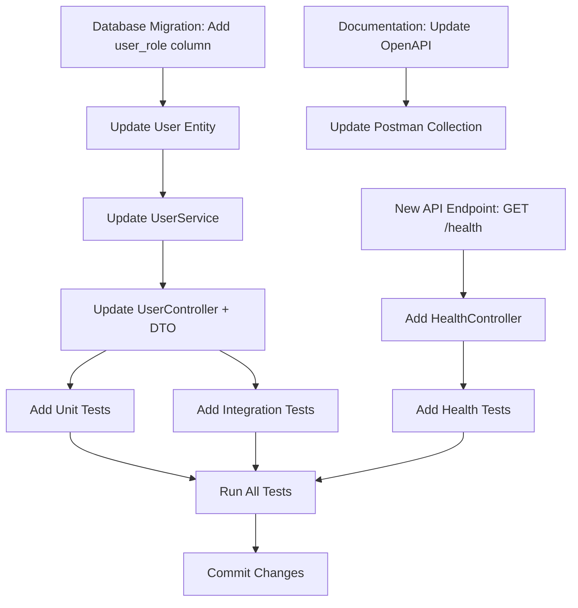

# Resolve Backend TODOs in Parallel

## Model Recommendation

**⚠️ MODEL SWITCH RECOMMENDED**: Switch to **Claude Sonnet** for this TODO resolution phase.

For optimal results with this command:
1. Switch to Sonnet model for careful TODO analysis and resolution planning
2. Use parallel processing to handle multiple TODOs efficiently
3. Ensure strategic thinking for complex dependencies

This leverages our multi-model workflow: Sonnet for complex analysis and planning (70% quality, 30% cost).

---

Resolve all TODO comments using parallel processing for backend development tasks.

## Workflow

### 1. Analyze

Get all unresolved TODOs from the /todos/\*.md directory and analyze their backend-specific requirements:

- API development tasks
- Database migration tasks
- Security fixes
- Performance optimizations
- Testing improvements
- Documentation updates

### 2. Plan

Create a TodoWrite list of all unresolved items grouped by type and dependencies. Make sure to analyze dependencies that might occur and prioritize the ones needed by others.

**Backend-Specific Dependencies:**

- **Database migrations must run before API changes** that depend on schema
- **Authentication changes** must complete before authorization changes
- **Service layer changes** before controller changes
- **Entity changes** before repository changes
- **DTO validation** before controller implementation
- **Test setup** before test implementation

**Dependency Analysis:**

For example, if you need to:
1. Add a new database column (migration)
2. Update TypeORM entity
3. Update service to use new field
4. Update controller/DTO
5. Add tests

These must run sequentially. However, independent tasks (different API endpoints, separate services, documentation) can run in parallel.

Output a mermaid flow diagram showing how we can execute these tasks:



The diagram should clearly show:
- Which tasks can run in parallel (different branches)
- Which tasks must run sequentially (arrows showing dependencies)
- Which tasks converge before final steps (testing, committing)

### 3. Implement (PARALLEL)

Based on the dependency analysis, spawn backend-specific resolver agents in parallel for independent tasks.

**Agent Assignment by Task Type:**

**For API Development Tasks:**
- Task api-designer(task_details) - For API design and endpoint planning
- Task nestjs-specialist(task_details) - For NestJS-specific implementation
- Task express-specialist(task_details) - For Express.js implementation

**For Database Tasks:**
- Task database-modeler(task_details) - For schema design
- Task typeorm-specialist(task_details) - For entity and migration implementation

**For Security Tasks:**
- Task security-auditor(task_details) - For security fixes and audits

**For Performance Tasks:**
- Task performance-analyzer(task_details) - For optimization implementation

**For Testing Tasks:**
- Task testing-specialist(task_details) - For comprehensive test creation

**For Documentation Tasks:**
- Task api-documenter(task_details) - For OpenAPI specs and documentation

**Parallel Execution Strategy:**

```
# Example: 5 independent tasks can run in parallel

Parallel Group 1 (can all run simultaneously):
1. Task nestjs-specialist(todo-042-add-health-endpoint)
2. Task api-documenter(todo-043-update-openapi-spec)
3. Task testing-specialist(todo-044-add-user-service-tests)
4. Task security-auditor(todo-045-fix-jwt-validation)
5. Task performance-analyzer(todo-046-optimize-query-performance)

Sequential Group 1 (must run in order):
1. Task database-modeler(todo-047-add-user-role-field)
   ↓
2. Task typeorm-specialist(todo-048-update-user-entity)
   ↓
3. Task nestjs-specialist(todo-049-update-user-service)
   ↓
4. Task testing-specialist(todo-050-test-user-role)
```

**Backend-Specific Parallel Execution Rules:**

✅ **CAN run in parallel:**
- Independent API endpoints (different resources)
- Separate database tables/entities
- Different service classes
- Independent test files
- Documentation tasks
- Security fixes in different modules
- Performance optimizations in different areas

❌ **CANNOT run in parallel (must be sequential):**
- Database migration → Entity update → Service update → Controller update
- Authentication → Authorization (dependency)
- Parent entity → Child entity (foreign key dependency)
- Service layer → Controller layer (same feature)
- Implementation → Tests (for same feature)

### 4. Validation & Testing

After parallel execution completes, run comprehensive validation:

**Backend Testing Suite:**

```bash
# TypeScript compilation
npm run build || tsc --noEmit

# Linting
npm run lint || eslint . --ext .ts

# Unit tests
npm test || jest --coverage

# Integration tests
npm run test:integration || jest --config jest.integration.config.js

# E2E tests (if applicable)
npm run test:e2e

# Type checking
tsc --noEmit --pretty

# Database migration validation (test rollback)
npm run migration:run
npm run migration:revert
npm run migration:run
```

**API Testing:**

```bash
# Test all endpoints with Postman (if Postman MCP available)
# Validate OpenAPI spec compliance
# Check response schemas
# Verify authentication/authorization
# Test error scenarios
```

**Database Validation:**

```bash
# Verify migrations applied successfully
# Check indexes created
# Validate constraints
# Test query performance
```

### 5. Commit & Resolve

**Pre-commit Checklist:**

- [ ] All tests pass (unit + integration)
- [ ] TypeScript compilation successful
- [ ] ESLint passes with no warnings
- [ ] No console.log statements in production code
- [ ] API documentation updated (OpenAPI spec)
- [ ] Postman collection updated (if applicable)
- [ ] Database migrations tested (up and down)
- [ ] Breaking changes documented
- [ ] CHANGELOG updated

**Commit Strategy:**

```bash
# If all tasks are related (same feature):
git add .
git commit -m "feat(api): implement user role-based access control

- Add user_role column to users table (migration)
- Update User entity with role field
- Implement role-based guards in NestJS
- Add RBAC tests (unit + integration)
- Update OpenAPI spec with role requirements
- Add Postman collection examples

Breaking changes:
- All protected endpoints now require role claim in JWT

Refs: #042, #043, #044, #045
"

# If tasks are unrelated, create separate commits:
git add src/api/health/*
git commit -m "feat(health): add health check endpoint"

git add src/api/users/* src/database/migrations/*
git commit -m "feat(users): add role-based access control"

git add docs/* postman/*
git commit -m "docs: update API documentation and Postman collection"
```

**Resolve TODOs:**

- Mark all completed TODO items as resolved
- Update todo file status from `pending` to `completed`
- Archive completed todos (move to `todos/completed/`)
- Document any remaining work or follow-up items

**Push Changes:**

```bash
# Push to remote branch
git push origin feature-branch-name

# Or create PR if work is complete
gh pr create --title "feat: [description]" --body "[details]"
```

## Backend-Specific Considerations

### Breaking API Changes

If any todo involves breaking API changes:

1. **Document the change:**
   ```markdown
   ## Breaking Changes
   - Endpoint: `GET /api/v1/users`
   - Change: Added required `role` query parameter
   - Migration: Clients must include `?role=user` in requests
   - Version: Affects v1, new behavior in v2
   ```

2. **Update API version** (if using versioning)
3. **Add deprecation warnings** to old endpoints
4. **Notify API consumers** before merging
5. **Update migration guides**

### Database Migrations

For todos involving database changes:

1. **Test migration on fresh database:**
   ```bash
   npm run migration:run
   ```

2. **Test rollback:**
   ```bash
   npm run migration:revert
   ```

3. **Test with production-like data:**
   - Create seed data
   - Run migration
   - Verify data integrity
   - Test application functionality

4. **Document migration:**
   ```typescript
   /**
    * Migration: Add user_role column
    *
    * Changes:
    * - Add role column to users table
    * - Create index on role column
    * - Set default role to 'user'
    *
    * Rollback: Drops role column and index
    *
    * Data impact: None - column is nullable with default
    */
   ```

### Performance Optimizations

For performance-related todos:

1. **Benchmark before:**
   ```bash
   # Record baseline metrics
   npm run benchmark
   ```

2. **Implement optimization**

3. **Benchmark after:**
   ```bash
   # Compare with baseline
   npm run benchmark
   ```

4. **Document improvement:**
   ```markdown
   ## Performance Improvement
   - Endpoint: GET /api/v1/users
   - Before: 450ms (p95)
   - After: 125ms (p95)
   - Improvement: 72% reduction
   - Method: Added Redis caching, optimized query with indexes
   ```

### Security Fixes

For security-related todos:

1. **Verify fix with security tests:**
   ```bash
   # Run security-specific tests
   npm run test:security
   ```

2. **Check for similar vulnerabilities:**
   - Search codebase for similar patterns
   - Apply fix consistently across codebase

3. **Update security documentation:**
   - Document the vulnerability
   - Describe the fix
   - Add to security checklist

4. **Run dependency audit:**
   ```bash
   npm audit
   npm audit fix
   ```

## Final Summary

After all todos resolved:

```markdown
## Backend TODOs Resolution Complete

**Total TODOs Resolved:** [X]
**Execution Mode:** [Parallel/Sequential/Mixed]
**Execution Time:** [Y minutes]

### Completed Tasks by Category:
- 🌐 API Development: [count]
- 🗄️ Database: [count]
- 🔒 Security: [count]
- ⚡ Performance: [count]
- ✅ Testing: [count]
- 📝 Documentation: [count]

### Database Changes:
- Migrations created: [count]
- Tables modified: [list]
- Indexes added: [count]

### API Changes:
- New endpoints: [count]
- Modified endpoints: [count]
- Breaking changes: [Yes/No - list if yes]
- OpenAPI spec updated: [Yes/No]

### Test Coverage:
- Unit tests added: [count]
- Integration tests added: [count]
- Coverage change: [before% → after%]

### Performance Improvements:
- Optimized endpoints: [list]
- Response time improvements: [details]
- Query optimizations: [count]

### Commits Created:
- [commit SHA] - [commit message]
- [commit SHA] - [commit message]

### Next Steps:
1. Create pull request: `gh pr create`
2. Request code review from backend team
3. Run CI/CD pipeline
4. Test on staging environment
5. Plan deployment (especially for migrations)
6. Notify API consumers if breaking changes
```
